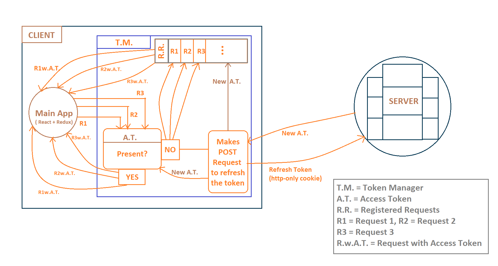

# Node-Chat-Web-Client

React + Redux Frontend for NodeChat.

## Storing JWT access token
Uses (Access Token + Refresh Token) pair to authorize an user. Refresh token is stored as Http-only cookie (server sends refresh token as http-only cookie). Whereas `TokenManager` is used to store the access token given by the server. This way, access token is safe (or almost safe) from XSS attacks as well as CSRF attacks(only the refresh token is sent to the server in this case so the server responds with `NotAuthorized Error` as access token is absent). When user refreshes the page, the client app, sends POST request to '/refresh' endpoint along with the refresh token(as http-only cookie) and the server responds with a new Access token that the client stores in the `TokenManager`.

## TokenManager
It is a class that uses `Singleton pattern` to maintain a single `TokenManager` instance across the client app. When the client app loads in the browser, the `TokenManager` is instantiated( activated ).

Important to note that, multiple React components may need the access token in very short time( for example, if three different React components try to fetch some protected resources at almost the same time ) leading to multiple `POST` requests to the `/refresh-token` endpoint. And so it will create multiple access tokens ( three different access-tokens in the above case ). To avoid that, it does not directly make the fetch request, instead it registers all the client functions that need the access token and makes a single `POST` request. Once, it gets a response (access-token or error), it passes the response to all the registered client requests.

### Workflow of TokenManager
- When a React component tries to fetch some protected resource, it first asks for the access token from the TokenManager.
- TokenManager checks if it has the access-token. If yes, then it returs the access-token. If no, then it registers the request(made by client app) and makes `POST` request to `/refresh-token`. Once it gets a response, it passes the response to all the registered requests and stores the new access-token(if received).
